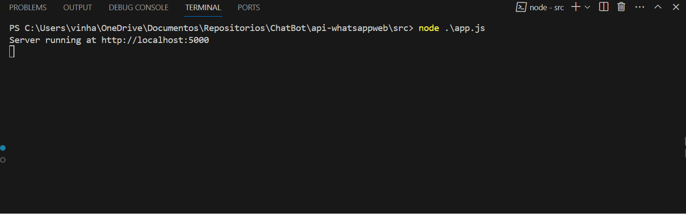
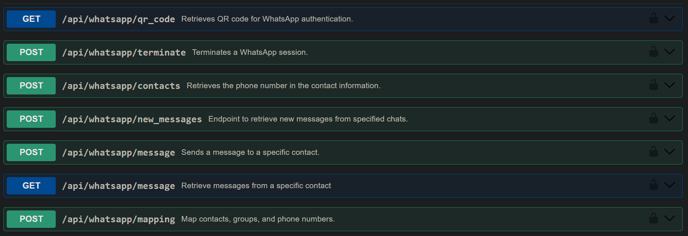

# API WhatsApp Web Interface


This API simulates the interface between the user and WhatsApp Web, enabling programmatic interaction with WhatsApp. It provides functionalities such as sending messages, receiving messages, and intercepting new messages. This documentation covers the setup, available endpoints, and usage examples.

### Demo Live



### Routes



## Getting Started

### Prerequisites

- Node.js (v12.x or later)
- npm (v6.x or later)

### Installation

1. Clone the repository to your local machine.

```bash
git clone <repository-url>
```

2. Navigate into the cloned repository.

```bash
cd api-whatsappweb
```

3. Install the necessary dependencies.

```bash
npm install
```

4. Create a `.env` file in the root directory and fill in the necessary environment variables:

```plaintext
PORT=5000
BASIC_AUTH_USERNAME=admin
BASIC_AUTH_PASSWORD=secret
```

### Running the API

Start the API server with the following command:

```bash
npm start
```

The server will start running on `http://localhost:5000`. Access the Swagger documentation at `http://localhost:5000/api-docs` for an interactive API reference.

## API Endpoints

### Authentication

This API uses HTTP Basic Authentication to secure its endpoints. Use the username and password defined in your `.env` file to authenticate requests.

### QR Code Retrieval

- **GET `/api/whatsapp/qr_code`**: Retrieves a QR code for WhatsApp authentication. Scan this QR code with your WhatsApp mobile app to establish a session.

### Session Management

- **POST `/api/whatsapp/terminate`**: Terminates an established WhatsApp session. Requires a session token in the request body.

### Messaging

- **POST `/api/whatsapp/message`**: Sends a message to a specific contact or group. Requires the session token, chatId (contact or group ID), and the message text in the request body.
- **POST `/api/whatsapp/new_messages`**: Retrieves new messages from specified chats. Requires the session token and total number of chats to search in the request body.

### Contact Management

- **POST `/api/whatsapp/contacts`**: Retrieves the phone number for a given contact name. Requires the session token and contact name in the request body.

## Usage Examples

Below are examples of how to use the API endpoints:

### Getting QR Code

```bash
curl -u admin:secret http://localhost:5000/api/whatsapp/qr_code
```

### Sending a Message

```bash
curl -u admin:secret -X POST -H "Content-Type: application/json" -d '{"token": "your-session-token", "chatId": "contact-or-group-id", "message": "Hello, World!"}' http://localhost:5000/api/whatsapp/message
```

### Getting New Messages

```bash
curl -u admin:secret -X POST -H "Content-Type: application/json" -d '{"token": "your-session-token", "totalChats": 5}' http://localhost:5000/api/whatsapp/new_messages
```

## Development

### Structure

The API structure is organized into several directories under `/src`:

- **controllers**: Contains `whatsappController.js` for routing API requests.
- **middlewares**: Includes `authMiddleware.js` for authentication.
- **services**: Contains `whatsappService.js` and `browserService.js` for business logic.
- **utils**: Utilities like `fileUtil.js`, `tokenUtil.js`, and more, for common functionalities.

### Swagger Configuration

API documentation is configured in `swaggerConfig.js`. It uses Swagger to define and document the API endpoints.

## Contributing

Contributions to improve the API are welcome. Please follow the standard fork and pull request workflow.

### Author

Luis Vinhali - Site Reliability Engineer @ Since 2018

[](https://www.linkedin.com/in/luisvinhali/)

- 📫 How to reach me: vinhali@outlook.com
- 😄 Pronouns: He/Him
- 💰 Pay me a Coffee: [fe60fe92-ecba-4165-be5a-3dccf8a06bfc](https://nubank.com.br/cobrar/qy85z/65faec0b-b19e-46ce-b321-743b9b38f31f) (pix)